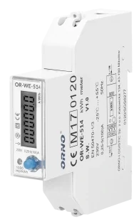

# collectd-orno
Collectd plugin for Orno energy meters

This plugin allows [collectd](https://www.collectd.org/) to fetch data from energy meters made by [Orno](https://orno.pl/en), using ModBus protocol over RS-485.

Currently, only models [WE-514](https://orno.pl/en/product/1078/1-phase-energy-meter-with-rs-485-100a-rs-485-port-mid-1-module-din-th-35mm) and [WE-525](https://orno.pl/en/product/4073/1-phase-energy-meter-with-rs-485-100a-rs-485-port-mid-1-module-din-th-35mm) have been tested, but it might work with other devices using the same protocol.

You will need one of their DIN-rail modules (and an electrician to wire it up):



And a USB to RS-485 adapter (easy to find on chinese marketplaces):


## Available metrics

The following metrics are collected :

- Frequency (Hz)
- Voltage (V)
- Current (A)
- Active Power (W)
- Reactive Power (Var)
- Apparent Power (VA)
- Power Factor
- Active Enery (kWh)
- Reactive Enery (kVarh)

And for the model WE-525, these additional ones:

- Reverse Active Enery (kWh)
- Reverse Reactive Enery (kVarh)

## Dependencies

This plugins require `minimalmodbus` and pyserial `libraries`. Usually `pip install minimalmodbus pyserial` will do.
See [collectd-python(5)](https://ipv4.collectd.org/documentation/manpages/collectd-python.5.shtml) for more details on installation.

## Collectd configuration

Add the following snippet to your collectd configuration :

```
<LoadPlugin python>
  # Unlike most other LoadPlugin lines, this one should be a block containing the line "Globals true"
  # Because it is python plugin
  # `man 5 collectd-python`
  Globals true
</LoadPlugin>

<Plugin python>
  ModulePath "/path/to/the/module/collectd-orno"

  # To output python traces in syslog, set 'true'
  LogTraces true

  Import "orno_modbus"
  <Module orno_modbus>
    Verbose false
    Device "/dev/ttyUSB0"
    Model "WE-525"
  </Module>

</Plugin>
```

## Credits

Shout out to the Orno company who propery documented their protocol.

This video is not sponsored, I bought these modules with my own money.

